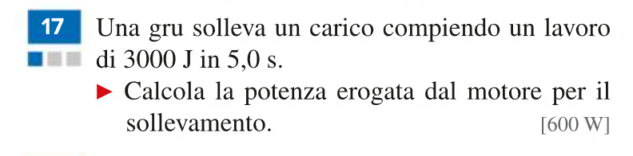
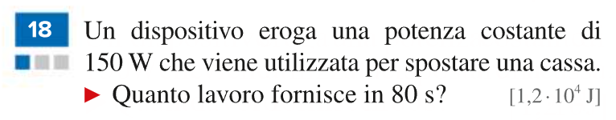
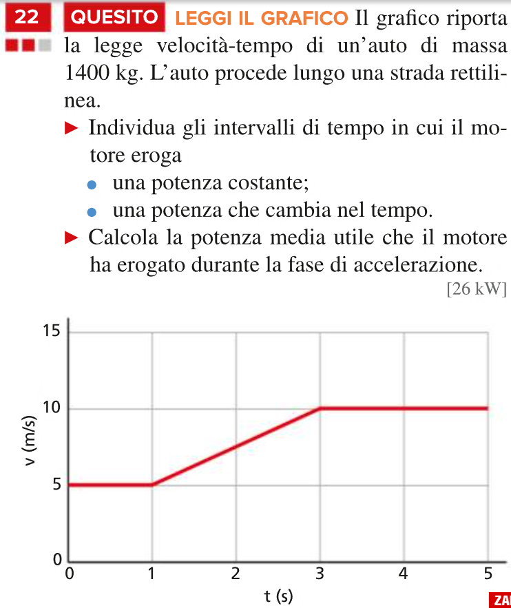
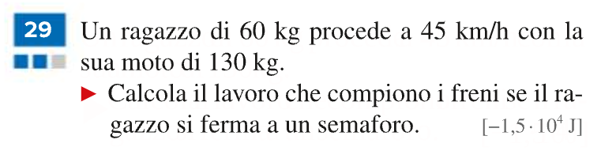
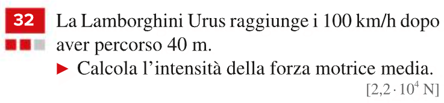

# Fisica

[Indietro](./../index.md)

- [Fisica](#fisica)
  - [Teoria](#teoria)
    - [Grandezze](#grandezze)
  - [Esercizi](#esercizi)
    - [Pagina 429](#pagina-429)
      - [Esercizio 17](#esercizio-17)
      - [Esercizio 18](#esercizio-18)
      - [Esercizio 19](#esercizio-19)
      - [Esercizio 22](#esercizio-22)

## Teoria

- [Grandezze](#grandezze)

### Grandezze

- 10^-16 = Quark
- 10^-15 = Neutroni
- 10^-14 = Nucleo atomico
- 10^-13 - 10^-10 = Atomo
- 10^-9 = Molecola d’acqua
- 10^-8 = Molecola del DNA
- 10^-7 = Virus
- 10^-6 = Cromosoma
- 10^-5 = Cellula
- 10^-4 - 10^-3 = Occhio di mosca
- 10^-2 - 10^2 = Tutto ciò che si vede ad occhio
- 10^3 = Pezzo di città
- 10^4 = Città
- 10^5 = Una regione
- 10^6 = Una nazione
- 10^7 - 10^8= Pianeta
- 10^9 = Stella
- 10^11 = Coda di cometa
- 10^13 = Sistema solare
- 10^16 = 1 anno luce
- 10^18 = Ammasso di stelle
- 10^21 = Galassia
- 10^25 = Mappa delle galassie esterne

### Energia
#### Energia Cinetica
$$K=\frac{1}{2}mv^{2}$$
Si misura in $J$ oule

$$K_{\text{finale}}-K_{\text{iniziale}} = L \text{ (Lavoro)}$$
## Esercizi

- [429](#pagina-429)
  - [17](#esercizio-17)
  - [18](#esercizio-18)
  - [19](#esercizio-19)
  - [22](#esercizio-22)
- [430](#pagina-430)
  - [29](#esercizio-29)
  - [32](#esercizio-32)

### Pagina 429
#### Esercizio 17

$$
\frac{3000J}{5.0s} = 600W
$$

#### Esercizio 18

$$
150W*80s=12000=1.2*10^{4}
$$

#### Esercizio 19

Formula
$$
W=\frac{J}{s}
$$
quindi
$$
s=\frac{J}{W}
$$
quindi
$$
T=\frac{530J}{30W}=17.6667s\approx18s
$$

#### Esercizio 22

Il motore eroga una potenza costante negli intervalli t=0@1, t=3@5
Nell'intervallo t=1@3 il motore eroga una potenza che cambia

$ P = \frac{(m*\frac{V}{T})*s}{T} = \frac{(1400*\frac{5}{2})*(5*2+\frac{1}{2}2.5*4)}{2} = \frac{3500*15}{2} = \frac{52500}{2} = 26000$

### Pagina 430
#### Esercizio 29

$ K=\frac{1}{2}m*156.25=14843.75 $

$ V=12,5\frac{m}{s} $

$ m = 190kg $

#### Esercizio 32

$ M = 2300kg $

$ V = 100\frac{km}{h}$

$ s = 40m $

$ K = \frac{1}{2}m*V^{2} = \frac{1}{2}*2300*(27.8\frac{m}{s})^{2} = 887000J $

$ F * s = K = 887000J $

$ L = \frac{887000J}{40m} = 22 * 10^{3}N $