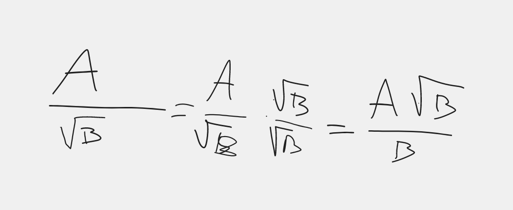

# Matematica

[Indietro](./matematica.md)

## Legenda
- [Frazioni Algebriche](#frazioni-algebriche)
- [Razionalizzazione](#razionalizzazione)
- [Radicali Doppi](#radicali-doppi)
- [Esercizi](#esercizi)

## Frazioni Algebriche

## Razionalizzazione

## Radicali Doppi

## Esercizi

- [Pagina 871](#pagina-871)
  - [Esercizio 222](#esercizio-222)
- [Pagina 872](#pagina-872)
  - [Esercizio 244](#esercizio-244)

### Pagina 871
#### Esercizio 222

##### a
$(a-2)x-2y-1 = 0\rightarrow-2y = -(a-2)x+1\rightarrow2y = (a-2)x-1\rightarrow y = \frac{a-2}{2}x-\frac{1}{2}\rightarrow \frac{a-2}{2} = 0\rightarrow a-2 = 0 \rightarrow a = 2$
$$$$
$$$$
$$$$
$$$$
$$$$
$$$$

##### b
$$(a-2)x-2y-1 = 0$$
$$(a-2)x = 2y+1$$
$$x = \frac{2y+1}{a-2}$$

A non può cambiare $2y$ per farlo diventare $0y$

##### c
Per fare in modo che la retta sia parallela a 
$$2x-y+1=0$$
bisogna portare la retta in forma esplicita.
$$-y=-2x-1$$
$$y=2x+1$$

deve essere = 2

$$(a-2)x-2y-1 = 0$$
$$-2y = -(a-2)x+1$$
$$2y = (a-2)x-1$$
$$y = \frac{a-2}{2}x-\frac{1}{2}$$

$$\frac{a-2}{2} = 2$$
$$a-2 = 2*2$$
$$a = 4+2$$
$$a = 6$$

##### d
$$6x+3y+4=0$$
$$3y=-6x-4$$
$$y=-2x-\frac{4}{3}$$

Per essere perpendicolare $-2  * (a-2) = -1$

$$-2a+4=-1$$
$$-2a=-5$$
$$a=\frac{5}{2}$$

### Pagina 872
#### Esercizio 244

Formula delle rette
$$
y=mx+q
$$

Applicandola alla retta rossa
$$m=\frac{40-0}{0-30}=-\frac{4}{3}$$
$$m=\frac{0-20}{0-30}=\frac{2}{3}$$

La formula delle rette sono quindi:
- $y = -\frac{4}{3}x+40$
- $y = \frac{2}{3}x$

Si incontrano nella risoluzione del sistema

$$
\begin{cases}
y=-\frac{4}{3}x+40
\\
y=\frac{2}{3}x
\end{cases}
$$

sostituiamo il primo y con la 2^ equazione

$$
\begin{cases}
\frac{2}{3}x=-\frac{4}{3}x+40
\\
y=\frac{2}{3}x
\end{cases}
$$

$$
\begin{cases}
2x=40
\\
y=\frac{2}{3}x
\end{cases}
$$

$$
\begin{cases}
x=20
\\
y=\frac{2}{3}x
\end{cases}
$$

$$
\begin{cases}
x=20
\\
y=\frac{2}{3}20
\end{cases}
$$

$$
\begin{cases}
x=20
\\
y=\frac{40}{3}
\end{cases}
$$

Si incontrano dopo 20 minuti a $\frac{40}{3}*10^{3}m$
