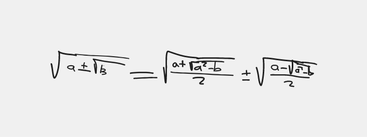
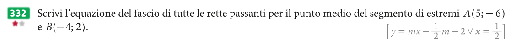

# Matematica

[Indietro](./matematica.md)

## Legenda
- [Matematica](#matematica)
  - [Legenda](#legenda)
  - [Frazioni Algebriche](#frazioni-algebriche)
  - [Razionalizzazione](#razionalizzazione)
  - [Radicali Doppi](#radicali-doppi)
  - [Piano Cartesiano](#piano-cartesiano)
  - [Rette](#rette)
  - [Esercizi](#esercizi)
    - [Pagina 717](#pagina-717)
      - [Esercizio 459](#esercizio-459)
      - [Esercizio 460](#esercizio-460)
    - [Pagina 871](#pagina-871)
      - [Esercizio 222](#esercizio-222)
        - [a](#a)
        - [b](#b)
        - [c](#c)
        - [d](#d)
    - [Pagina 872](#pagina-872)
      - [Esercizio 244](#esercizio-244)
    - [Pagina 879](#pagina-879)
      - [Esercizio 328](#esercizio-328)
      - [Esercizio 332](#esercizio-332)
    - [Pagina 880](#pagina-880)
      - [Esercizio 337](#esercizio-337)
        - [a](#a-1)
        - [b](#b-1)
        - [c](#c-1)

## Frazioni Algebriche

## Razionalizzazione

## Radicali Doppi

## Piano Cartesiano
## Rette
$ y = mx + q $
con $m$ come inclinazione

## Esercizi

### Pagina 717
#### Esercizio 459

$$ 
D =
\begin{bmatrix} 
2a & -6
\\
-3a & +6
\end{bmatrix}
= 12a-18a = -6a
$$

$$
Dx =
\begin{bmatrix}
5a & -6
\\
20a & +6
\end{bmatrix}
= 30a + 120a = 150a
$$

$$
Dy =
\begin{bmatrix}
2a & 5a
\\
-3a & 20a
\end{bmatrix}
= 40a^2 + 15a^2 = 55a^2
$$

$$ x = \frac{150a}{-6a} = -25 $$
$$ y = \frac{55a^2}{-6a} = -\frac{55}{6}a $$
$$ a \ne 0 $$
#### Esercizio 460

$$
D = 
\begin{bmatrix}
1 & 4
\\
a & a
\end{bmatrix}
= 1a - 4a = -3a
$$

$$
D_x =
\begin{bmatrix}
2 & 4
\\
0 & a
\end{bmatrix}
= 2a - 0 = 2a
$$

$$
D_y =
\begin{bmatrix}
1 & 2
\\
a & 0
\end{bmatrix}
= 0 - 2a = -2a
$$

$$
x = \frac{2a}{-3a} = -\frac{2}{3}
$$

$$
y = \frac{-2a}{-3a} = \frac{2}{3}
$$

Presupponendo $a \ne 0$

### Pagina 871
#### Esercizio 222

##### a
$(a-2)x-2y-1 = 0\rightarrow-2y = -(a-2)x+1\rightarrow2y = (a-2)x-1\rightarrow y = \frac{a-2}{2}x-\frac{1}{2}\rightarrow \frac{a-2}{2} = 0\rightarrow a-2 = 0 \rightarrow a = 2$

##### b
$$(a-2)x-2y-1 = 0$$
$$(a-2)x = 2y+1$$
$$x = \frac{2y+1}{a-2}$$

A non può cambiare $2y$ per farlo diventare $0y$

##### c
Per fare in modo che la retta sia parallela a 
$$2x-y+1=0$$
bisogna portare la retta in forma esplicita.
$$-y=-2x-1$$
$$y=2x+1$$

deve essere = 2

$$(a-2)x-2y-1 = 0$$
$$-2y = -(a-2)x+1$$
$$2y = (a-2)x-1$$
$$y = \frac{a-2}{2}x-\frac{1}{2}$$

$$\frac{a-2}{2} = 2$$
$$a-2 = 2*2$$
$$a = 4+2$$
$$a = 6$$

##### d
$$6x+3y+4=0$$
$$3y=-6x-4$$
$$y=-2x-\frac{4}{3}$$

Per essere perpendicolare $-2  * (a-2) = -1$

$$-2a+4=-1$$
$$-2a=-5$$
$$a=\frac{5}{2}$$

### Pagina 872
#### Esercizio 244

Formula delle rette
$$
y=mx+q
$$

Applicandola alla retta rossa
$$m=\frac{40-0}{0-30}=-\frac{4}{3}$$
$$m=\frac{0-20}{0-30}=\frac{2}{3}$$

La formula delle rette sono quindi:
- $y = -\frac{4}{3}x+40$
- $y = \frac{2}{3}x$

Si incontrano nella risoluzione del sistema

$$
\begin{cases}
y=-\frac{4}{3}x+40
\\
y=\frac{2}{3}x
\end{cases}
$$

sostituiamo il primo y con la 2^ equazione

$$
\begin{cases}
\frac{2}{3}x=-\frac{4}{3}x+40
\\
y=\frac{2}{3}x
\end{cases}
$$

$$
\begin{cases}
2x=40
\\
y=\frac{2}{3}x
\end{cases}
$$

$$
\begin{cases}
x=20
\\
y=\frac{2}{3}x
\end{cases}
$$

$$
\begin{cases}
x=20
\\
y=\frac{2}{3}20
\end{cases}
$$

$$
\begin{cases}
x=20
\\
y=\frac{40}{3}
\end{cases}
$$

Si incontrano dopo 20 minuti a $\frac{40}{3}*10^{3}m$

### Pagina 879
#### Esercizio 328

$A(2;-1) m=0, m=3, m=-2$
$$ -1=2n+q $$
$$ q=-2n-1 $$
$$ y=mx-2n-1 $$
$$ x=2 $$

#### Esercizio 332

$$ M(\frac{5+(-4)}{2}, \frac{-6+2}{2}) \rightarrow M(\frac{1}{2}, -2) \rightarrow y+2=m(x-\frac{1}{2}) \rightarrow y=mx-\frac{1}{2}m-2 \text{ v } x=\frac{1}{2} $$

### Pagina 880
#### Esercizio 337

$$ Q(-1, 2) $$
$$ y = mx+q $$
$$ 2 = m*(-1)+q $$
$$ 2 - m*(-1) = q $$
$$ q = 2 + m$$

##### a
$$
\begin{cases}
q = 2 + m
\\
-3 = m0 + q
\end{cases}
$$
$$
\begin{cases}
q = 2 + m
\\
-3 = q
\end{cases}
$$
$$
\begin{cases}
-3 = 2 + m
\\
-3 = q
\end{cases}
$$
$$
\begin{cases}
m = -5
\\
-3 = q
\end{cases}
$$
$$
y = -5x - 3
$$

##### b
Essere paralleli all'asse delle x vuol dire essere perpendicolari all'asse delle y, quindi l'equazione è $y=q$ con $q$ numero noto. Essendo che il componente y di $Q$ è un punto per cui la retta deve passare per forza allora $Q = q$ in quanto è il punto più lontano di una retta, che deve essere parallela per ipotesi.

##### c
L'essere perpendicolare a un asse di un segmento vuol dire essere paralleli al segmento in quanto che l'asse è sempre perpendicolare al segmento.

$$
A(0, 1) | B(4, 0)
$$

$$
\begin{cases}
1 = m0 + q
\\
0 = m4 + q
\end{cases}
$$
$$
\begin{cases}
q = 1
\\
q = 0 - m4
\end{cases}
$$
$$
\begin{cases}
q = 1
\\
1 = -m4
\end{cases}
$$
$$
\begin{cases}
q = 1
\\
-\frac{1}{4} = m
\end{cases}
$$
$$
y = -\frac{1}{4}x-\frac{1}{4}+1
\rightarrow
\text{Perchè l'equazione di un fascio di rette è } y=mx+m+q
$$

##### d
$$
\begin{cases}
y = mx + m + 2
\\
x = 0
\end{cases}
\rightarrow
\begin{cases}
y = m + 2
\\
x = 0
\end{cases}
\rightarrow
F(0; m + 2)
$$
Facciamo lo stesso con y=0
$$
\begin{cases}
y = mx + m + 2
\\
y = 0
\end{cases}
\rightarrow
\begin{cases}
0 = mx + m + 2
\\
y = 0
\end{cases}
\rightarrow
\begin{cases}
x = -1 - \frac{2}{m}
\\
y = 0
\end{cases}
\rightarrow
G(-1-\frac{2}{m}; 0)
$$
Troviamo il punto medio tra F e G con la solita formula $M(\frac{x_f + x_g}{2}; \frac{y_f+y_g}{2})$
$$
M(-\frac{m+2}{2m};\frac{m+2}{2})-\frac{n+2}{2n}=\frac{3}{2} \rightarrow -\frac{n+2}{n} = 3 \rightarrow -n-2 = 3n \rightarrow 4n = -2 \rightarrow n = -\frac{1}{2}
$$