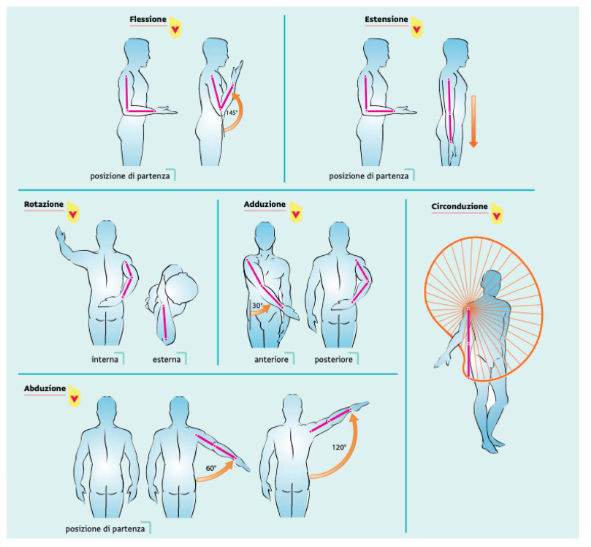
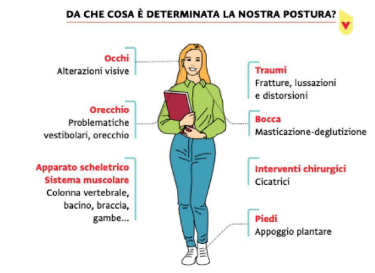
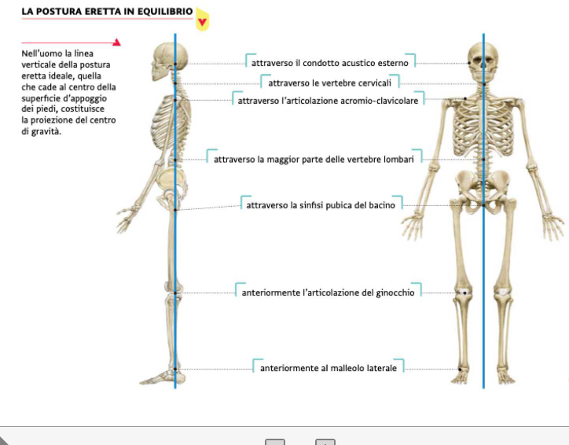
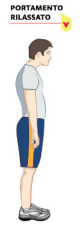
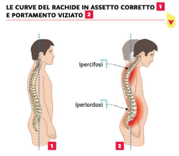
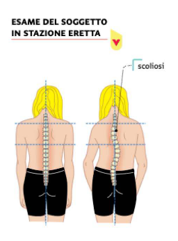
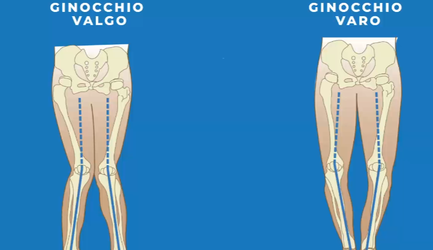
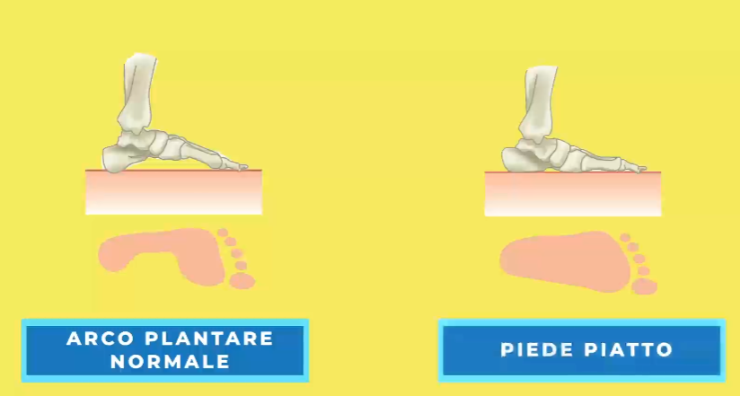

# Scienze Motorie

[Indietro](../index.md)

## Le articolazioni
### Le sinartrosi
Articolazioni fisse, uniscono due ossa vicine senza farle muovere, esempio nel cranio

### Le anfiartrosi
Le articolazioni semimobili, permettono movimenti molto limitati

### Le diartrosi
Articolazioni mobili, tipo quelle della spalla

## I movimenti

## Gli Apparati
### L'apparato scheletrico

Quando si è giovani l'apparato osseo è plastico perché l'osso non si è ancora composto del tutto, e quindi si può modellare tramite stimoli esterni. Il movimento se ben eseguito può guidare l'accrescimento.

Svolgere attività fisica durante l'adolescenza permette infatti di aumentare la densità e di prevenire malattie degenerative.

Alcune sollecitazioni eccessive possono indurre a deformazioni permanenti.

Le ossa infatti seguono la legge dei tessuti che dice:
- eccitazioni deboli danno origine all'attività vitale
- eccitazioni medie la stimolano
- eccitazioni forti la danneggiano
- eccitazioni violente la arrestano.

## La Postura
Si sente molto parlare della postura. Il termine indica la posizione che il nostro corpo deve assumere.
Avere una buona postura significa:
- Meno dolori a muscola e articolazioni
- Meno difficoltà (spesa di energie) a contrastare la gravità
- Maggiore sicurezza

Tramite lapostura esprimiamo il nostro rapporto con il mondo circostante.

Se una postura scorretta è protatta nel tempo si possono generare deformazioni strutturali.

Uno degli elementi più colpiti è la colonna vertebrale

### Alterazioni della postura e paramorfismi
**I paramorfismi** sono atteggiamenti scorretti che si protraggono nel tempo. Quando il paramorfismo si protrare per troppo tempo mpm può più essere modificato e prende il nome di **dismorfismo**.

#### Il portamento rilassato
Il soggetto si presenta con il capo inclinato in avanti, l'addome prominente, le spalle cadenti, i piedi piatti e altro, in seguito si instaurano atteggiamenti scoliotici

#### Ipercifosi e Iperlordosi
sono le curve eccessive della colonna vertebrale. L'atteggiamento dell'ipercifosi si trasforma in dorso curvo *(la gobba)* se non si agisce nella fase di accrescimento (8-12 anni).
Determina problemi alla respirazione e una diminuita elasticità della gabbia toracica

L'iperlordosi (ricordati lordo -> lardo -> Pancia) è un accentuata rotazione del bacino in avanti.

#### La scoliosi
La scoliosi è una deviazione laterale di uno o più segmenti della colonna vertebrale

#### Le scapole alate

Quando le scapole si staccano dalla gabbia toracica a formare una cosa che ricorda le ali

#### Ginocchio valgo e varo

Quando le ginocchia assumono una forma a x (valgo) o una forma a () (varo)

#### Il piede piatto

Quando il piede tocca completamente perterra

