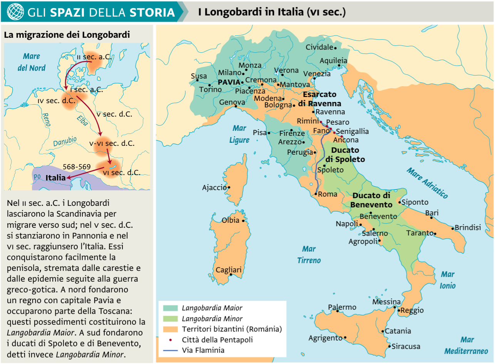
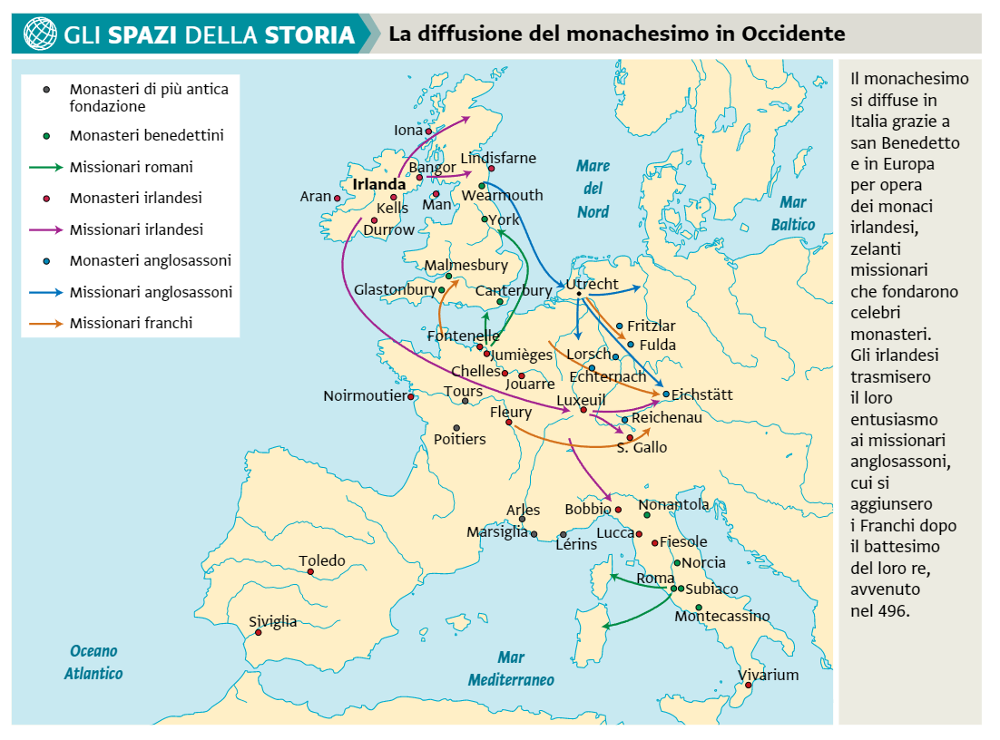
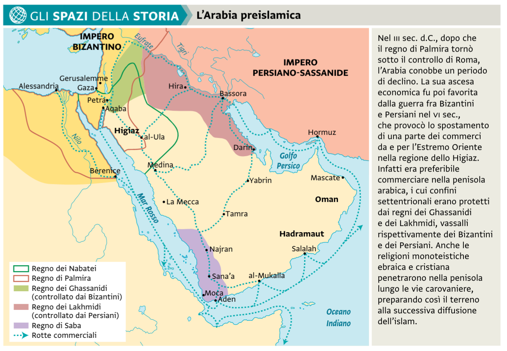

# Medioevo

[Indietro](./../storia.md)

## L'alto Medioevo

### Regni romano-germanici

- Goti
  - Ostrogoti (Goti di oriente)
  - Visigoti (Goti di occidente)
- Vandali
- Burgundi
- [Franchi](#franchi)

### Generalmente

Molte delle popolazioni barbariche vennero ammesse nel territorio Romano, soprattutto durante l'impero di Teodosio.

### L'impero bizantino

- [Prova a riprendere le coste del mediterraaneo](../roma/impero.md#giustiniano-i-527-565)
- [Crea il Corpus Iuris Civilis](../roma/impero.md#giustiniano-i-527-565)

Ai bizantini non interessava invadere la pianura padana, interessava tenere Roma, Ravenna e un collegamento terrestre tra le due città. Conservarono anche il governo delle aree costiere, delle isole maggiori e i porti strategici.
Si iniziò quindi a parlare di una romanìa (romagna), (appunto Ravenna si trova in emilia-romagna).

Giustignano all'inizio però fece riconquistare l'Italia, distruggendo i goti (guerra greco-gotica). Il dominio durò solo 15 anni (dopo arrivarono i longobardi)

### Ostrogoti

Partendo dalla regione dell'ucraina, si stanziano in Italia (spinti dai bizantini) dopo la caduta di Ravenna (nuova capitale dell'impero romano).
I bizantini li liquideranno un po' di tempo dopo.

### Longobardi

#### I re longobardi

- Alboino (568-572)
- Clefi (572-574)
- Autari (584-590)
- Agilulfo (591-616)
- Teodolinda (reggente di Adaloaldo, 616-627)
- Rotari (643-652)
- Liutprando (712-744)
- Ratchis (744-749)
- Astolfo (749-756)
- Desiderio (756-774)

I longobardi erano un popolo di stirpe germanica. Erano originari della scandinavia, ma poi si spostarono in Ungheria e infine arrivarono in Italia.

Sconfiggono i bizantini che occupavano l'Italia dopo la guerra greco-gotica anche se quest'ultimi riescono a tenere Roma e Ravenna e un "corridoio di terra" in Italia e si stanziano nella pianura padana con capitale Pavia. Poi creano il Ducato di Spoleto e il Ducato di Benevento.

Alla fine dell'VIII secolo vengono liquidati dai Franchi.

(Cartina presa dal libro)

#### La società longobarda

I longobardi erano organizzati in fare (+ di 1 fara), ovvero clan di famiglie.

Dentro una fara le famiglie erano devote al capo clan, ma tra le fare c'era spesso una rivalità.

Il territorio era suddivisio in Ducati, *tra cui quello Spoleto e quello Benevento.*
In un primo tempo era il ré a nominare il duca, in un secondo tempo non aveva  piu' abbastanza potere di farlo.

Si suddivise il territorio in longobardia maior (poi Italianizzata con il tempo in lombardia) e la longobardia minor, che conteneva dei microregni autonomi, ovvero i ducati nominati precedentemente.

**I duchi** assegnarono metà del loro dominio al rè, assicurandogli una base economica per poter esercitare il potere.

**I gastaldi**, funzionari nominati dal ré, si occupavano dell'amministrazione del territorio.

**Gli arimanni** erano guerrieri liberi che dipendevano direttamente dal re. Potevano intervenire all'assemblea generale del regno.

**Gli aldi** erano  unomini di condizione semilibera, spesso artigiani.

#### Il rafforzamento del regno

Alla morte per congiura di Alboino il regno (oltre al breve perido di Clefi) rimase senza un re.

Gli imperatori dell'impero bizantino, assieme al papa, chiesero aiuto ai franchi per rimuovere dall'Italia i longobardi, i duchi si misero d'accordo per rieleggere un re, a cui regalarono metà dei loro territori, divenne demanio reale. Il sovrano si garantiva così una base economica sufficiente per governare e reclutare soldati.

I gastaldi come detto prima erano persone che amministravano il demanio.

Autari estese ulteriormente il dominio longobardo in Italia, provò a normalizzare i rapporti con le popolazioni assoggettate e impose loro un regolare tributo.

Strinsero inoltre un alleanza con i Bàvari per contrastare i Bizantini.

Agilulfo proseguì ancora nella conquista dell'Italia, arrivando fino a Roma, dove il papa Gregorio Magno comprò l'incolumità di essa pagando un tributo. I longobardi infatti volevano migliorare le relazioni tra loro e il papato.

Sempre sotto Agilulfo la capitale longobarda passò da Monza a Milano

#### La religione longobarda

Sotto Autari, la moglie Teodolinda, principessa bavara, inizià a convertire i Longobardi dal cattolicesimo al cristianesimo.

#### Le leggi

Per un primo momento i longobardi non ebbero una legge. Solo successivamente con l'editto di Rotari si scrisse una raccolta di leggi, che vietava la faida (occhio per occhio, dente per dente), fino a quel momento tradizione. Ma manteneva "l'ordalia", ovvero il duello per discolpa, dove i due imputati venivano sottoposti a terribili prove, che se vinte, si sarebbero salvati.

Venne invece imposto il guidrigildo, ovvero il risarcimento pecuniario dei danni, anche se costava di più risarcire un ricco che un povero.

#### La caduta dei Longobardi

[Guarda qui](#franchi)

### Franchi

Clodovero (re) sceglie di far convertire Clodovero e i Franchi cristiani cattolici.

Erano strettamente legati alla chiesa, diventano cattolici (molte popolazion barbariche diventano ariane).

Sotto il controllo del re Pipino e la richiesta del iniziano la riconquista di alcune delle terre dell'impero romano d'occidente sotto richiesta del papa, tra cui l'Italia.

Dopo un po' di tempo il papa chiese dinuovo aiuto ai franchi che, guidati da Carlo (futuramente detto Magno) scesero in italia ponendo fine ai Longobardi. Tutti i territorio tranne il ducato di Benevento passarono sotto dominio Franco

### La chiesa

Il papa dopo la caduta dell'impero romano d'occidente era diventato un punto di riferimento politico (oltre che spirituale e culturale).

#### Gregorio Magno

Venne mandato come delegato dai bizantini, tornato a Roma divenne pontefice nonostante le sue condizioni di salute. Si batté per contenere l'espansione dei longobardi in italia ma poi lo convertì a cattolico. Cercò di rappacificare Bizantini e Longobardi.

Era rispettato da Bizantini, Longobardi, Franchi e visigoti.

Provò a rendere cristiani anche i popoli anglosassoni.

Divenne santo.

#### Gregorio II

Successore di Gregorio Magno ottenne dono dal re longobardo la rocca laziale di Sutri e alcune altre vicine. Questo gesto aveva un duplice significato.

- Riconosceva al papa il potere di governare come un legittimo sovrano un territorio.
- Allontanava la Chiesa dall'impero bizantino, che formalmente possedeva ancora quei territori.

Questo allontanamento politico-culturale è stato favorito dall'adozione del greco come lingua ufficiale dei bizantini e l'iconoclazia di Leone III Isaurico (Imperatore d'oriente).

Con questa donazione diventava effettivo un falso documento che si diceva scritto da Costantino e che avrebbe donato a papa Silvestro I la città di Roma. Ma probabilmente è stato scritto in quegli anni per legittimare la donazione di Sutri.

### Il Monachesimo

#### La fondazione del monachesimo

Il fondatore è considerato sant'Antonio abate, che si ritirò in meditazione nel deserto e visse una vita lunghissima con digiuno, preghiere e abbandono di qualsiasi forma associativa. Alcuni cristiano si ritirarono sull'esempio di sant'Antonio.

Un po' dopo si affermò anche il monachesimo in cui i monaci si organizarono in cenobi, delle comunità fatte solo da monaci. Il primo a creare un cenobio si pensa che sia stato Pacomio. Scrisse una Regola, ovvero delle leggi che i monaci della comunità dovevano rispettare. Essi facevano voto di castità e di obbedienza al monaco superiore (Abate).

#### San Benedetto

San Benedetto è tra i santi più venerati dalla cristianità. Studiò a roma e poi diventò un eremita presso Subiaco dove poi fondò un cenobio. Poi a causa di alcuni dissapori si spostò a Montecassino dove fondò quello che divenne il primo dei monasteri benedettini. Creeò un motto, "ora et labora" ovvero "prega e lavora". I monaci benedettini dovevano costruire una comunità autonoma e autosufficiente.

#### Monastero

Dentro un monastero erano presenti quasi sempre:

- Una chiesa
- Le residenze dei monaci
- edifici di servizio come magazzini, granai, etc.
- a volte lo scrittorium
- Un muro di cinta contro i briganti
- dopo l'anni mille il campanile

##### Lo scriptorium

Ertano dei posti contenuti nei monasteri, dove c'erano monaci addetti a:

- Creare la pergamena e in futuro la carta per i grandi libri (codici)
- Scrivere i codici (Opere della chiesa e opere classiche latine (Le opere greche vennero reintrodote dagli arabi in spagna e dai culturati che scappavano dall'impero bizantino quando veniva conquistato il territorio dagli arabi))
- (non ovunque) Creare liste di tutti le opere dei monasteri

#### San Patrizio

San Patrizio convertì al cristianesimo l'irlanda dove i monasteri divennero centri economici e culturali importanti.

Monaci irlandesi si trasferirono in europa.

### Gli Arabi

#### Periodo preislamico

Data la posizione geografica "centrale" tra i grandi imperi, a ovest l'impero romano e a nordest l'impero partico, ma già dall'impero di Alessandro, e i mari, sono favoriti ai commerci.
Erano molto commerciate anche le spezie, tra cui l'incenso, e aromi, molto ricercati per l'alimentazione.

L'arido entroterra era abituato dai beduini, tribu' nomadi "alla ricerca delle oasi". Erano pastori e cavalcavano i dromedari.

##### La religione Araba

Gli arabi erano politeisti, pagani. Adoravano divinità legate alla natura. Spesso adoravano degli idoli, tra cui uno che ancora adesso è adorat: la pietra nera.

Erano diffuse anche religioni esterne, come l'ebraismo e il cristianesimo.

La ka'ba è un santuario a La Mecca, dove è contenuta la pietra nera (meteorite, che si pensava mandato dal dio). La leggenda vuole che il santuario sia stato fatto dal patriarca ebraico Abramo.

#### La nascita dell'islam

L'islam è una religione derivata dall'ebraismo. Prende come penultimo profeta Gesu'. L'ultimo profeta è appunto Maometto, fondatore dell'islam.

##### Maometto

Maometto apparteneva alla tribu' che governava la mecca, orfano, si sposa con una vedova.
Quando aveva circa 40 anni iniziò ad avere visioni. Poi nel 610 ebbe la rivelazione di Dio tramite l'arcangelo Gabriele.

#### L'islam

La predicazione dell'islam è un movimento eversivo, confronto a quelli attuali, appunto indolatri e politeisti.
